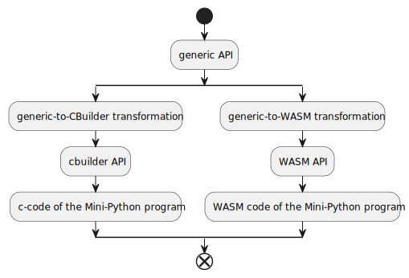
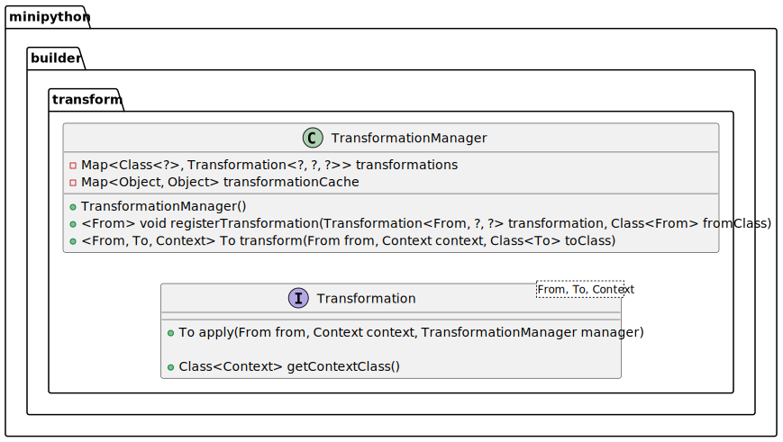

# Transformation / Lowering

This chapter presents the so-called `Transformation`-API.
This API is responsible for providing the structure to convert between different variants of the Mini-Python Builder API.
It is used to implement the conversions from generic API to CBuilder and WASM API, respectively.
That is,
the implemented transformations allow users of the generic (output format independent) Mini-Python Builder API
to choose the backend they prefer,
without having to change any of their uses of the Builder API.



Note that the `Transformation`-API only provides the raw building blocks for implementing such transformations,
while the responsibility to implement cosmetics is shifted to users of the API (i.e. implementors of transformations).
(E.g. the generic-to-CBuilder transformation implementation provides a static method to convert a generic Mini-Python program representation
into a CBuilder specific one.)

## Goal

The goal of this Transformation-API is to faciliate the transformation
of a source representation into a target representation.
The Transformation-API is based on the idea,
that the source representation can be transformed into the target trepresentation by describing how to transform each class of the source representation into a class of the target representaton.
Thus the API only requires the implementation of a single method
per class in the source representation.

The Transformation-API is datastructure agnostic,
that is,
the API does neither use nor mandate a specific datastructure
(e.g. a graph/tree representation)
in order to transform between representations.
Instead, it uses the naturally formed graph structure formed between objects
in Java.

## Overview

The `Transformation`-API is structured around
the `Transformation` interface and the `TransformationManager` class.
A `Transformation` implementation describes how to convert
a single class that is part of the source representation
into a class of the target representation.
The `TransformationManager` then combines the individual
`Transformation`s.



A class is only transformed once,
to ensure that references to the same object
point to the same, now converted, object
after the transformation too.
(I.e., transformation results are cached based on reference equality.)


A complete transformation implementation from source representation to target representation thus contains a `Transformation` implementation for each class that is part of the source representation,
each yielding a class that is part of the target representation.

## Example: Generic-to-CBuilder Transformation

A simple example that transforms the generic `IntLiteral` into the CBuilder `IntLiteral`:

```java
// the transformation does not use any context, so use Object;
// which works for any actual context object
class IntLiteralTransform implements Transformation<generic.IntLiteral, cbuilder.IntLiteral, Object> {

    public cbuilder.IntLiteral transform(generic.IntLiteral from, Object context, TransformationManager manager) {
        return new cbuilder.IntLiteral(from.value);
    }

    public Class<Object> getContextClass() {
        return Object.class;
    }

}
```

Extending this example, the transformation of a VariableDeclaration looks like this:

```java
// the transformation still does not use any context, so use Object;
// which works for any actual context object
class  implements Transformation<generic.variables.Assignment, cbuilder.variables.Assignment, Object> {
    public cbuilder.variables.Assignment transform(generic.variables.Assignment from, Object context, TransformationManager manager) {
        return new cbuilder.variables.Assignment(
            // the generic Assignment holds a VariableDeclaration to assign to,
            // while the CBuilder Assignment expects a Reference.
            manager.transform(from.lhs, context, cbuilder.Reference.class),
            // the generic Assignment holds a generic Expression for the value to assign,
            // while the CBuilder Assignment expects a CBuilder Expression.
            manager.transform(from.rhs, context, cbuilder.Expressionc.class)
        );
    }

    public Class<Object> getContextClass() {
        return Object.class;
    }
}
```

## Tips

- write a static wrapper method around the implemented transformations,
    that registers the transformations and calls transform on the top-level
    argument (which is the argument to the wrapper method)
- do not implement the Transformation interface on the representation classes,
    but create specific Transformation classes for this purpose
- the transformation source class must always be the most specific class
    (there is not automatic fall back to look up translations of the parent class(es)),
    while the target class can be any parent class/implemented interface (as long as the target class/interface is compatible with the actual class returned by the transformation)

## Special Case: Recursive Datastructures

At some point of the Transformation implementation,
the error "recursion detected when transforming" might come up.
This error indicates,
that during Transformation of an object A,
at some point a call to `TransformationManager#transform()` occured
that passed the same object A.
This of course cannot work.

With this in mind, the `Transformation` interface actually looks like this:


The addition of the `postApply` method allows to delay
the transformation of the recursive part of the datastructure
until after an resulting object of the transformation
already exists.
Therefore, the recursion from the start of this section cannot happen anymore: When the recursive `transform` call occurs, there's already an transformation result available, that is returned.
